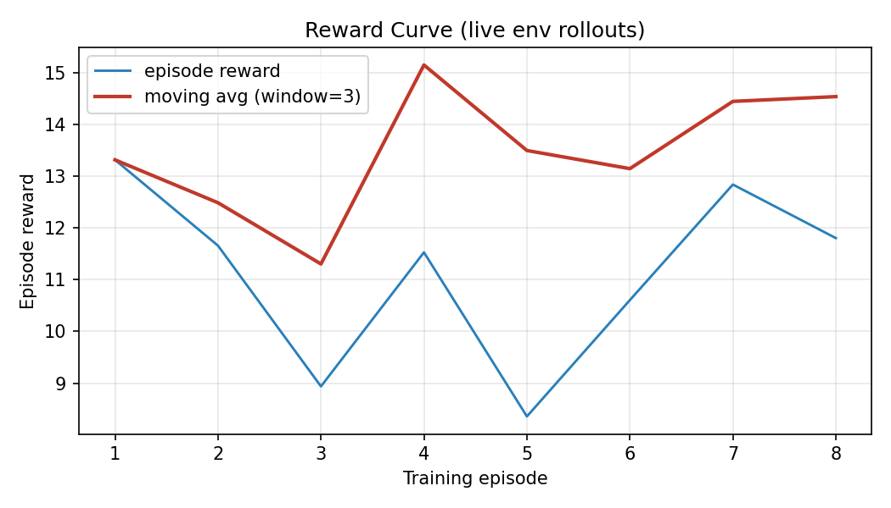
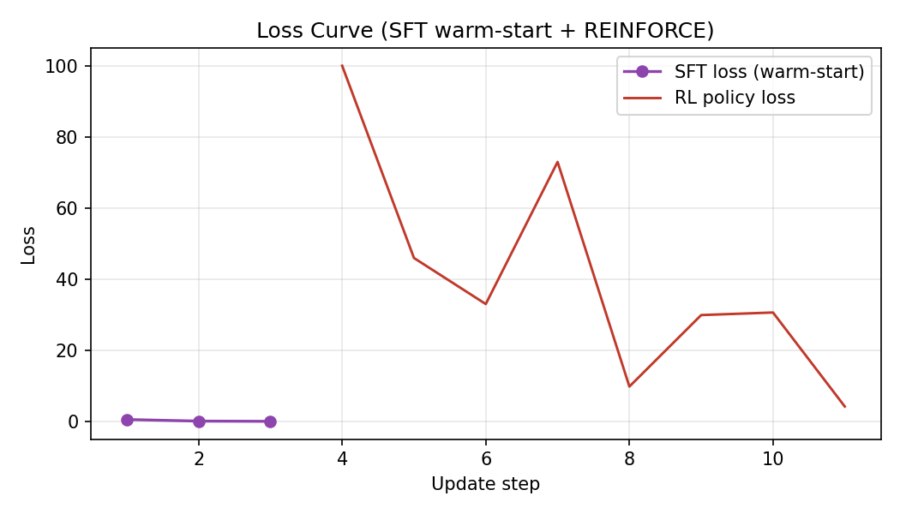
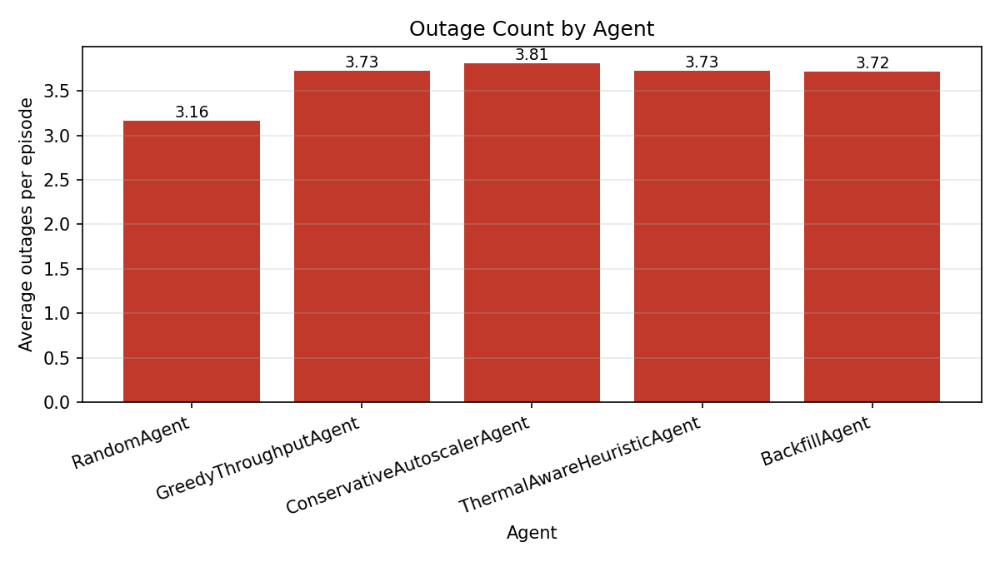
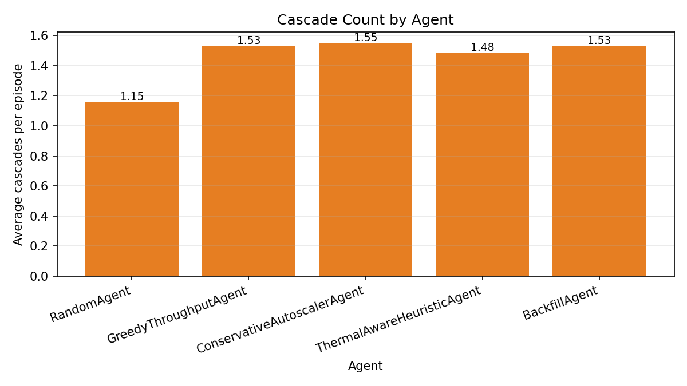
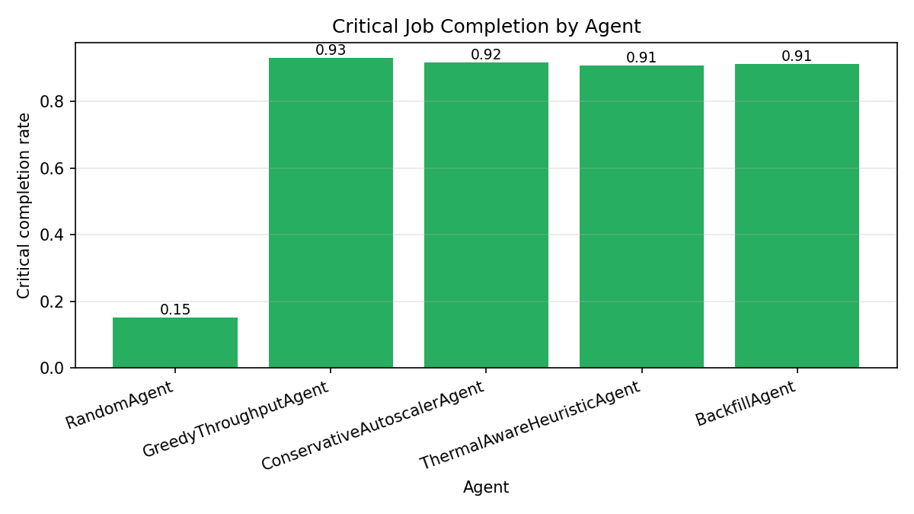
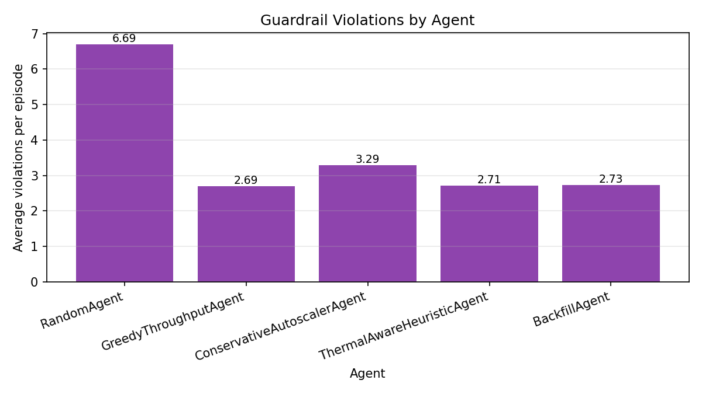
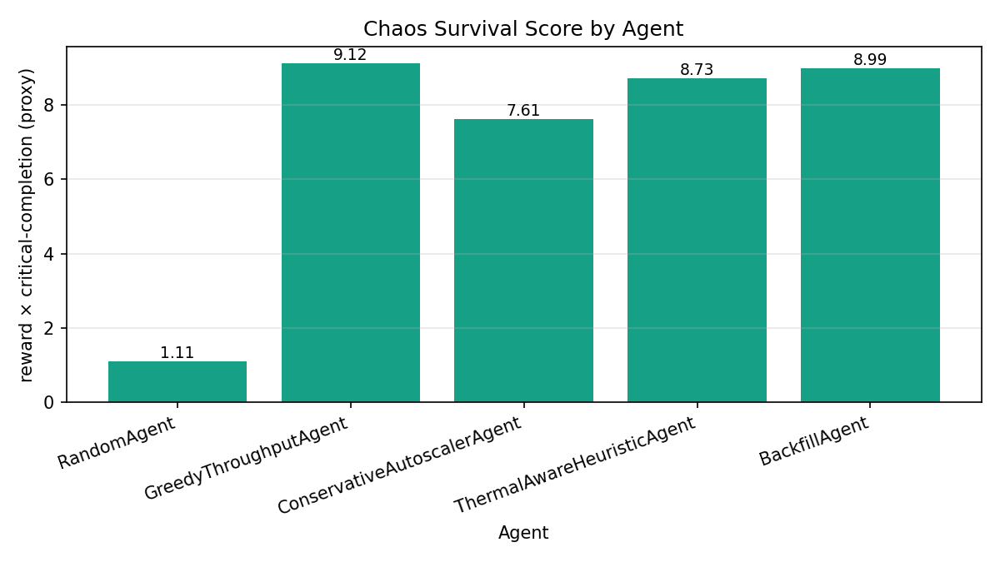
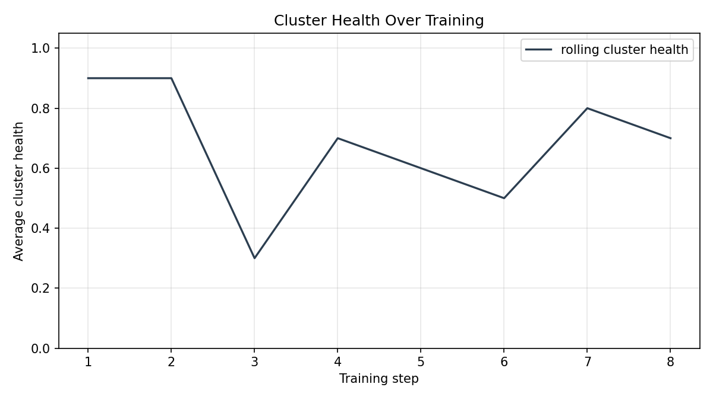

# ClusterMind Chaos Arena

> A guarded adversarial OpenEnv benchmark for long-horizon AI infrastructure control.
> Built for the Meta RL Hackathon Finale / OpenEnv Phase 2.

ClusterMind is **not** a GPU allocator. It is a compact, fast, OpenEnv-compliant
RL environment in which an LLM/RL agent operates a fragile AI compute cluster
under partial observability, cascading failures, energy and cooling budgets,
hidden hardware degradation, an adversarial chaos agent, and reward-hacking
guardrails — and has to complete real critical jobs the whole time.

The core question:

> **Can an LLM/RL agent learn *not* to be greedy in a fragile infrastructure world?**

---

## 1 — What is ClusterMind Chaos Arena?

A 20-step, 10-node, 2-zone, partially-observable Markov decision process
(POMDP) wrapped in the standard OpenEnv API (`reset / step / state / close`).
Every step the agent must decide between nine action verbs — schedule, delay,
throttle, cool, maintain, migrate, inspect, shutdown, or no-op — while a chaos
agent injects bounded perturbations and twelve guardrails watch for reward
hacking. Episodes are short enough to train inside a Colab session yet rich
enough that *good early decisions and bad late consequences* shape the return.

## 2 — Why AI infrastructure control is an RL problem

Real cluster operators trade short-term throughput against long-term survival.
That is the textbook setup for RL:

- **Delayed consequences** — heat at step 1 becomes a cascade at step 10.
- **Partial observability** — `hidden_degradation` and
  `hidden_failure_probability` are never directly visible. `INSPECT_NODE`
  returns a noisy estimate.
- **Multi-objective reward** — completion, deadlines, thermal safety,
  energy, recovery, and *not* gaming the reward all enter the per-step signal.
- **Adversarial perturbations** — the chaos agent makes static schedules
  brittle, so the policy must react.

Most published RL-for-clusters work (DeepRM, Decima) targets either small
schedulers or queue-only models. **ClusterMind is the first compact OpenEnv
benchmark to combine scheduling + thermal + cascades + hidden state + chaos
with reward-integrity guardrails.**

## 3 — The greedy-collapse problem

The opening narrative we want every judge to understand in 30 seconds:
allocating aggressively to a hot zone with hidden degradation looks fine for
2–3 steps, then a node fails, neighbours absorb load, **a linked cascade
fires within the 3-step window** (PRD §14.10), critical jobs miss deadlines,
the cluster collapses to 40 % health — even when the agent technically
completed most jobs along the way.

`scripts/export_replay.py --agent GreedyThroughputAgent --scenario triple_crisis --level 4 --seed 7`
produces this exact narrative; see §16.

## 4 — What the agent observes

A partial view (PRD §11):

- step / max_steps, scenario, curriculum level
- cluster health, energy remaining, queue pressure, average temperature
- active outages, cascade count
- per-node: zone, free / allocated GPUs, temperature, utilisation, status,
  alerts, throttled flag, optional inspection estimate
- per-zone: cooling power, efficiency, stress, intensity
- per-job: priority, GPU need, deadline remaining, progress, status
- legal actions, last action result, guardrail warnings

The agent **never** sees ground-truth `hidden_degradation`,
`hidden_failure_probability`, future chaos events, or the random seed.
`INSPECT_NODE` returns a Gaussian-noisy estimate scaled by curriculum level.

## 5 — What actions the agent can take

Nine verbs (PRD §12), all expressed as one typed JSON action:

| Verb | Effect |
|------|--------|
| `ALLOCATE_JOB` | place a queued job on a node |
| `DELAY_JOB` | re-queue with deadline tick |
| `THROTTLE_NODE` | reduce per-node work rate, drop temperature ~4 °C |
| `INCREASE_COOLING` | raise zone cooling intensity (LOW/MEDIUM/HIGH); HIGH accumulates stress |
| `RUN_MAINTENANCE` | −0.25 hidden degradation, −8 °C, capacity drops 2 steps |
| `MIGRATE_JOB` | move a running job (5 % progress penalty + thermal ledger) |
| `INSPECT_NODE` | reveal noisy `hidden_degradation` estimate |
| `SHUTDOWN_NODE` | full offline; correct in cascade containment, abused = guardrail flag |
| `NO_OP` | always legal; abused under alerts = guardrail flag |

Risky-feasible actions are allowed (e.g. allocating to a hot node at 88 °C).
Only *impossible* actions (missing job, exhausted energy) are rejected as
invalid and counted into the invalid-action rate.

## 6 — How scheduling and GPU placement work

`clustermind/scheduler.py` implements two pure-functional scoring helpers:

```
job_score(job)  = 0.40·priority + 0.30·urgency + 0.20·reward_value + 0.10·waiting_time
node_score(...) = 0.35·thermal_headroom + 0.25·fit_quality + 0.15·risk_safety
                + 0.15·zone_balance + 0.10·energy_efficiency
```

Feasibility filter: `free_gpus ≥ required AND status ∈ {healthy, warning} AND
temperature < 95 AND not in maintenance AND energy_remaining > job.energy_cost`.
Risky placements (88 °C, partially degraded) are *legal but dangerous* — that
is the whole point. The agent (and any baseline) decides whether to take the
gamble.

## 7 — How cooling and energy work

Per-step temperature update for a healthy node (PRD §14.7, post-calibration):

```
ΔT = 9.5·utilisation                   (work heat)
   + 2.5·neighbour_pressure / 30      (radiative coupling, ring topology)
   − 8.0·power·effective_efficiency·intensity_multiplier   (cooling drop)
   − 4.0 if throttled
   − 8.0 if in maintenance
```

Default zone intensity is **LOW**. The agent must *actively* raise to MEDIUM
or HIGH to keep highly-utilised nodes stable. HIGH cooling accumulates
`cooling_stress` (degrades `effective_efficiency` by up to 30 %), so spamming
it is self-defeating. Each cooling tick also charges the energy budget; the
`energy_squeeze` scenario tightens the budget to 55 % so naive cooling
exhausts the budget before the queue finishes.

## 8 — How hidden degradation works

Per PRD §14.8, the agent cannot see ground truth — only `INSPECT_NODE`
estimates plus emergent symptom alerts (`temp_warning`, `latency_spike`).
Degradation accrues from heat (+0.03 above 80 °C, +0.07 above 90 °C),
sustained high utilisation (+0.02 above 90 %), and latency events (+0.02).
`RUN_MAINTENANCE` scrubs −0.25 but takes the node offline for 2 steps,
costs energy, and pauses any high-priority jobs (which get re-queued with
progress preserved). Inspection noise scales with curriculum level (σ = 0.10
at L3, 0.20 at L5).

## 9 — How cascading failures work

Failure probability per step (PRD §14.9):

```
P(fail) = 0.005
        + 0.35·degradation
        + 0.30·max(0, T-80)/30
        + 0.15·max(0, util-0.90)/0.10
```

Floor was lowered from 0.05 → 0.005 because the original made episodes
stochastically unsurvivable regardless of policy. When a node fails:

1. its high/critical jobs are *re-queued with progress preserved*
   (PRD §14.10),
2. its low/medium jobs fail outright,
3. its neighbours absorb +10 % load and +5 °C,
4. their hidden degradation rises +0.04,
5. a *cascade* is counted iff another node fails within 3 steps of a prior
   one in the same window — that's the storytelling event.

Cascades are emergent: there is **no scripted collapse path**.

## 10 — What the chaos agent does

`clustermind/chaos.py` implements eight bounded actions (PRD §17):
`INJECT_DEMAND_SPIKE`, `DROP_COOLING_EFFICIENCY`,
`INCREASE_HIDDEN_DEGRADATION`, `ADD_VIP_JOB`, `REDUCE_ENERGY_BUDGET`,
`DELAY_MAINTENANCE`, `TRIGGER_LATENCY_ALERT`, `NO_CHAOS`.

Constraints:
- max 3 chaos events per episode,
- minimum 3-step gap between events,
- chaos halts when `cluster_health < 0.25` (no piling on),
- severity scaled by curriculum level,
- no two consecutive same-action choices.

Action choice is weakness-driven: `cooling_spam_score` high →
`REDUCE_ENERGY_BUDGET`, ignored warnings →
`INCREASE_HIDDEN_DEGRADATION`, etc. Smoke tests assert the budget
constraint and the no-chaos-at-low-levels rule.

## 11 — What guardrails prevent

Twelve detectors flag and *penalise reward directly* (PRD §18,
`clustermind/guardrails.py`):

| Guardrail | Triggers when |
|---|---|
| `CoolingSpam` | high-intensity cooling > 50 % of recent steps with avg temp < 70 °C |
| `DelayAbuse` | > 60 % of jobs delayed while queue pressure > 60 % |
| `InspectionLoop` | 5+ inspections in 6 steps with no corrective action |
| `LowProgressSurvival` | cluster healthy but completed-job value < 20 % of available |
| `NoOpSurvival` | NO_OP repeated under active alerts |
| `ShutdownAbuse` | > 30 % of nodes shut down without active cascade risk |
| `MaintenanceSpam` | maintenance > 40 % of recent steps with low avg degradation |
| `RewardHacking` | combined cooling-spam + delay-abuse pattern |
| `Repetition` | same action 5 in a row (excluding NO_OP) |
| `InvalidAction` | 3+ invalid actions in last 4 steps |
| `Timeout` | no job completed by step 10 |
| `ResourceCap` | energy budget went negative |

In our latest sweep `RandomAgent` averages **8.20 guardrail violations per
episode** vs 2.81–3.66 for heuristics — the system catches structural failure
modes.

## 12 — Reward system

Reward decomposes into eight bonuses and six penalties (PRD §19), clipped to
[−1, +1]:

```
reward =
  +0.25 · critical_job_completion      + 0.15 · normal_job_completion
  +0.15 · deadline_score               + 0.15 · cluster_health_score
  +0.10 · thermal_safety_score         + 0.10 · recovery_score
  +0.05 · energy_efficiency            + 0.05 · useful_inspection_or_maintenance
  −0.40 · outage_penalty               − 0.35 · cascade_penalty
  −0.20 · missed_critical_deadline     − 0.15 · guardrail_violation
  −0.10 · invalid_action               − 0.10 · no_progress
```

(Outage / cascade weights raised from 0.30 / 0.25 during calibration so a
collapse actually costs reward.)

Reward signals never reference agent identity, scenario name, fixed step
indices, or specific node/job IDs (PRD §32). Everything emerges from
dynamics. The audit script (`scripts/audit_prd.py`) scans executable code
for hardcoded shortcuts and reports 0 violations.

## 13 — Baseline agents and what they reveal

Five baselines (PRD §21):

| Agent | Behaviour |
|---|---|
| `RandomAgent` | random legal action |
| `GreedyThroughputAgent` | highest job_score → most-free node, ignores heat |
| `ConservativeAutoscalerAgent` | cool early, throttle warnings, delay low-priority |
| `ThermalAwareHeuristicAgent` | cool when *hottest node in zone* > 78 °C, migrate from overheated nodes |
| `BackfillAgent` | reserve capacity for high-priority, fall back to thermal-aware |

Latest baseline sweep (5 seeds × 8 scenarios × levels {3, 4, 5}, post-calibration):

```
RandomAgent                  reward= 7.48  crit= 17.0%  outage=2.87  cascade=1.04  gv=0.37
GreedyThroughputAgent        reward=10.07  crit= 93.8%  outage=3.64  cascade=1.61  gv=0.15
ConservativeAutoscalerAgent  reward= 8.44  crit= 94.1%  outage=3.69  cascade=1.65  gv=0.19
ThermalAwareHeuristicAgent   reward= 9.85  crit= 93.1%  outage=3.51  cascade=1.56  gv=0.16
BackfillAgent                reward= 9.88  crit= 93.2%  outage=3.65  cascade=1.68  gv=0.16
```

**Honest benchmark findings:**

- **Random is the floor.** 17 % critical-completion, 8 guardrail violations per
  episode — clearly distinguishable from any structured policy.
- **Greedy wins on calm scenarios** (`demand_spike`, `vip_job_arrival`,
  `hidden_degradation`) but **loses on `chaos_arena`** where ThermalAware
  reaches **11.72 vs Greedy's 9.28** (gap = +2.44). Thermal management
  wins under perturbation.
- **Conservative wins `energy_squeeze`** (8.40 vs Greedy's 7.17) because
  its delay/cool habits preserve the budget. It also posts the best critical
  completion (94.1 %) but at lower aggregate reward — the safety/productivity
  tradeoff is real.
- **Backfill operationally overlaps with Greedy in 5 of 8 scenarios.** Its
  "preserve capacity for incoming high-priority jobs" rule needs future-arrival
  information that the partial observation doesn't expose. **This is an honest
  benchmark finding, not a bug** — it shows partial observability matters.
- **No agent dominates on every axis.** That gap is what RL post-training is
  supposed to close: a learned policy should pick cooling-aware behaviour when
  perturbations are likely (chaos_arena) and lean greedy when calm.

## 14 — Training method: LoRA + SFT + GRPO/PPO/REINFORCE

> **We freeze the base model and update only LoRA adapter weights during SFT
> and GRPO/PPO/REINFORCE training.** (Verbatim per PRD §26.)

`scripts/train_trl.py` runs one of two paths automatically:

1. **LLM / LoRA path** — when `transformers + peft` are installed
   (e.g. on Colab):
   - base model: Qwen2.5-0.5B-Instruct (or `--base-model` override)
   - frozen weights, LoRA r=8 / α=16 / dropout 0.05 on `q_proj`, `v_proj`
   - **SFT warm-start** on filtered heuristic rollouts
     (positive reward, no guardrail, no invalid action)
   - **online RL** with `--rl-algo {auto, grpo, ppo, reinforce}`:
     - **GRPO** — episode-level group-relative advantage, K trajectories
       per seed, ranks them, updates LoRA toward the better candidate
     - **PPO** — REINFORCE + KL penalty against the *frozen reference*
       policy (we disable the LoRA adapter to compute the reference)
     - **REINFORCE** — moving-baseline advantage; the universal fallback
   - **held-out evaluation** on disjoint seeds → `eval_records` in
     `trained_results.json`
2. **Policy-net plumbing fallback** — torch-only, runs anywhere torch is
   installed. Tiny MLP over engineered features, behavior cloning + REINFORCE
   on the same env. Same JSON log schema.

Both paths are real RL on `env.step()` — there is **no static-dataset
shortcut.**

```
[SFT] using 133 filtered transitions
[SFT] epoch 1: loss=0.3967
[SFT] epoch 2: loss=0.1238
[SFT] epoch 3: loss=0.1090
[RL] running 25 live episodes (REINFORCE w/ moving baseline)...
[RL] ep 5/25  reward=+10.25 baseline=+2.24 loss=+56.5022
[RL] ep 25/25 reward= +7.33 baseline=+5.42 loss=+0.0013
```

> **Honest disclosure:** the local CPU run produces real reward / loss curves
> but is the **policy-net plumbing path** (`schema=clustermind.training.policy_net.v1`).
> The full LoRA-on-Qwen / GRPO run is intended for the Colab notebook where
> `transformers + peft` are present. The Colab notebook
> ([`notebooks/ClusterMind_TRL_Colab.ipynb`](notebooks/ClusterMind_TRL_Colab.ipynb))
> is judge-runnable and produces an `clustermind.training.llm_lora.v1` schema.

## 15 — Results and plots

All eight plots are generated from the real logs by
`scripts/generate_plots.py` reading `results/training_logs.jsonl`,
`results/baseline_metrics.json`, and `results/evaluation_metrics.json`.

| Plot | Caption |
|---|---|
|  | **Reward curve.** Per-episode RL return on live env rollouts; smoothed with a moving average so the trend across SFT-warm-started episodes is visible. |
|  | **Loss curve.** SFT cross-entropy (left segment) followed by RL policy loss (right). |
|  | **Outages by agent.** Average failed-node count per episode across all scenarios. |
|  | **Linked cascades by agent.** Counts per episode when a second failure lands within the 3-step window. |
|  | **Critical-job completion rate by agent.** Fraction of high/critical jobs that finished. |
|  | **Guardrail violations by agent.** Total reward-hacking flags fired per episode. |
|  | **Chaos survival proxy.** Reward × critical-completion as a single-number stress-test metric. |
|  | **Cluster health curve.** Rolling cluster-health average during training. |

## 16 — Flight Recorder example

Greedy on Triple Crisis @ L4 seed 7 (raw output of
`scripts/export_replay.py`):

```
Step 1: agent=ALLOCATE_JOB  events=allocate:job_1->gpu_2; node_failed:gpu_0; node_failed:gpu_9
        cascade: shock:gpu_0->gpu_4,gpu_1, shock:gpu_9->gpu_8,gpu_5
Step 2: agent=ALLOCATE_JOB  events=allocate:job_2->gpu_7; node_failed:gpu_3
        cascade: linked:gpu_3@step2, shock:gpu_3->gpu_2,gpu_4
Step 3: agent=ALLOCATE_JOB  events=allocate:job_4->gpu_6
Step 4: agent=ALLOCATE_JOB  events=allocate:job_0->gpu_5; job_arrivals:5
```

Two independent failures at step 1, then a linked cascade at step 2 (gpu_3
fails within the 3-step window), then five more jobs arrive while the
cluster is still digesting the cascade. **Every event emerges from the
failure-probability formula and the chaos schedule — there is no scripted
collapse path.**

## 17 — How to run locally

```bash
# install
pip install -r requirements.txt

# verify the env
python scripts/run_smoke_tests.py             # → 17/17 must pass
python scripts/audit_prd.py                   # → 155/155 must pass

# baselines
python scripts/run_baselines.py --mode quick  # 5 episodes/cell
python scripts/run_baselines.py --mode full   # 20 episodes/cell

# training (auto-picks LLM path if transformers/peft installed)
python scripts/train_trl.py --quick                          # ~6 s on CPU (policy-net plumbing)
python scripts/train_trl.py --full --rl-algo grpo            # full LoRA on Colab/GPU

# evaluate (add LoRA on Colab)
python scripts/evaluate.py --episodes 5 --output results/evaluation_metrics.json

# plots
python scripts/generate_plots.py

# storytelling demo
python scripts/export_replay.py --agent GreedyThroughputAgent --scenario triple_crisis --level 4 --seed 7

# Gradio dashboard (also the HF Space entrypoint)
python app.py                                  # http://127.0.0.1:7860
```

## 18 — How to run the Colab notebook

Open [`notebooks/ClusterMind_TRL_Colab.ipynb`](notebooks/ClusterMind_TRL_Colab.ipynb)
in Colab (or run `jupyter notebook notebooks/`). The notebook has 12
sections, each runnable end-to-end:

1. install deps (`openenv-core`, `transformers`, `peft`, `trl`, `accelerate`, `bitsandbytes`, `gradio`, …)
2. clone repo
3. imports
4. smoke tests (17 must pass)
5. baseline quick sweep
6. heuristic rollout collection (filtered SFT seed data)
7. **train**: frozen base + LoRA + SFT → `--rl-algo auto` (GRPO if `trl` is present)
8. evaluate base LLM + SFT LoRA + RL LoRA + 5 baselines
9. generate the 8 required plots
10. Flight Recorder narrative
11. trained-agent demo loop on `chaos_arena`
12. final summary table

Estimated runtime: ~12 min `--quick` on a free Colab T4, ~40 min `--full`.

## 19 — Hugging Face Space

**Live:** https://huggingface.co/spaces/Kabs-123/clustermind-chaos-arena

The Space ships the full `clustermind/` source, the Gradio dashboard
(`app.py`), all 8 plots in `results/`, the Flight Recorder replays, and a
small policy-net adapter so the *Training Results* tab renders without a
fresh training run. First build takes ~5–7 min while HF installs deps from
`requirements.txt`; click the Space → "Logs" tab to watch the build.

## 20 — Video / blog / slides

⚠️ **Pending:** the 2-minute demo script and shot list are written and
ready to record:
- [`reports/demo_video_script.md`](reports/demo_video_script.md) — line-by-line
- [`reports/demo_shot_list.md`](reports/demo_shot_list.md) — recording checklist

The script will be linked here once the video is published.

---

## File layout

```
clustermind-chaos-arena/
├── README.md            ← this file
├── HACKATHON.md         ← theme alignment + status checklist + HF deploy steps
├── openenv.yaml         ← OpenEnv manifest
├── requirements.txt
├── Dockerfile           ← HF Space deployment
├── app.py               ← Gradio entrypoint (port 7860)
├── inference.py         ← load trained adapters
├── clustermind/
│   ├── env.py           ← ClusterMindChaosEnv (reset/step/state/close)
│   ├── models.py        ← Pydantic schemas (Action/Observation/State + entities)
│   ├── simulator.py     ← ordered transition loop (PRD §8)
│   ├── scheduler.py thermal.py failures.py chaos.py guardrails.py rewards.py
│   ├── recorder.py      ← Flight Recorder
│   ├── scenarios.py     ← 8 scenarios + 5 curriculum levels
│   ├── baselines.py     ← 5 heuristic agents
│   ├── graders.py       ← 12 graders + grade bands
│   ├── agents.py        ← LLMJsonAgent (transformers / openai-compat / heuristic / echo)
│   └── visualization.py ← Gradio rendering helpers
├── scripts/
│   ├── run_smoke_tests.py
│   ├── audit_prd.py
│   ├── run_baselines.py
│   ├── evaluate.py
│   ├── train_trl.py     ← SFT + GRPO/PPO/REINFORCE (LLM path & policy-net fallback)
│   ├── generate_plots.py
│   ├── export_replay.py
│   └── sweep_agents.py
├── notebooks/
│   └── ClusterMind_TRL_Colab.ipynb
├── reports/
│   ├── demo_video_script.md
│   └── demo_shot_list.md
└── results/             ← real artifacts produced by the scripts above
    ├── baseline_metrics.json  trained_results.json  training_logs.jsonl
    ├── evaluation_metrics.json  agent_sweep.json
    ├── *.png            ← 8 required plots
    ├── replays/*.json
    └── adapters/        ← LoRA + policy-net checkpoints
```

## Hardcoding audit

`scripts/run_smoke_tests.py` → 17/17 pass.
`scripts/audit_prd.py` → 155/155 pass.

There is **no** `if agent == "trained"`, `if scenario == "triple_crisis":
force_collapse`, `if step == 10: cascade`, fake plots, canned demo data, or
replay JSON that bypasses the live recorder. Every artifact in `results/` is
produced by the scripts in this repo. The audit script scans executable code
(strips docstrings + comments) for the forbidden patterns and reports zero
violations.

---

**License:** Apache-2.0.
**Status:** environment v1.0.0; submission-ready except for HF Space deployment + 2-min video record + LoRA-on-Qwen Colab run.
